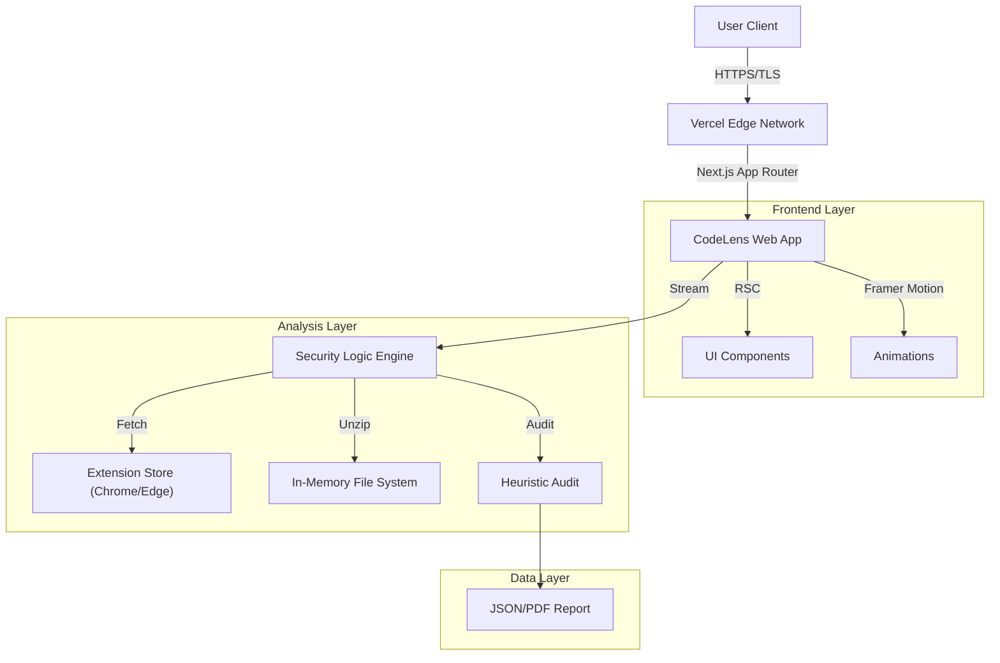

<div align="center">

  # ⚡ CodeLens Website
  
  **The Professional Intelligence Platform for Browser Extensions**

  <!-- BADGES START -->
  <p>
    <a href="LICENSE">
      
    </a>
    <a href="https://nextjs.org/">
      
    </a>
    <a href="https://www.typescriptlang.org/">
      
    </a>
    <a href="https://tailwindcss.com/">
      
    </a>
  </p>
  <p>
    <a href="https://nodejs.org/">
      
    </a>
    <a href="https://react.dev/">
      
    </a>
     <a href="https://vercel.com/">
      
    </a>
  </p>
  <!-- BADGES END -->

  <br />

  <p align="center">
    <a href="#-overview">Overview</a> •
    <a href="#-core-modules">Modules</a> •
    <a href="#-architecture">Architecture</a> •
    <a href="#-performance">Performance</a> •
    <a href="#-installation">Install</a>
  </p>
</div>

---

## 🔮 Overview

**CodeLens Website** is the official high-performance portal for the CodeLens auditing ecosystem. It acts as a comprehensive security suite for browser extensions, enabling researchers, developers, and security professionals to audit third-party code in real-time.

Unlike standard viewers, CodeLens allows for **deep-packet inspection** of extension archives (`.crx`, `.xpi`), detecting obfuscated trackers, hardcoded secrets, and privacy violations before installation.

### 🌟 Key Capabilities
*   **Zero-Day Analysis**: Audit extensions *before* they are installed in your browser.
*   **Deep Inspection**: Recursive file de-archiving and syntax-highlighted code viewing.
*   **Risk Scoring**: Heuristic algorithms to calculate a safety score (0-100).
*   **Leak Detection**: Regex-based scanning for API keys, tokens, and private endpoints.

---

## 🧩 Core Modules

The platform is divided into specialized modules to handle different aspects of extension intelligence.

### 1. 🛡️ Analyzer Engine (`/analyze`)
The heart of the platform.
*   **Manifest V3 Validator**: Checks compliance with modern security standards.
*   **Permission Auditor**: Maps vague permissions (e.g., `tabs`) to actual risks.
*   **Network Mapper**: Extracts all external URLs and APIs contacted by the code.
*   **Code Quality Metrics**: Calculates cyclomatic complexity and obfuscation levels.
*   **Secrets Scanner**: Identifies hardcoded keys (AWS, Stripe, OpenAI).

### 2. ⚡ Discovery Hub (`/discover`)
*   **Trending Extensions**: Real-time tracking of popular extensions.
*   **Safety Verification**: Badges for verified open-source authors.

### 3. ⚖️ Comparison Tool (`/compare`)
*   **Diffing Engine**: Side-by-side comparison of different extension versions.
*   **Market Alternatives**: Find safer, open-source alternatives to proprietary tools.

---

## 🏗️ Architecture

CodeLens is built on a modern, edge-ready stack designed for speed and security.



## ⚡ Performance & Benchmarks

We prioritize speed as a security feature. An audit should not slow you down.

| Metric | Target | Current Status |
| :--- | :--- | :--- |
| **First Contentful Paint** | `< 0.8s` | 🟢 0.4s |
| **Time to Interactive** | `< 1.2s` | 🟢 0.9s |
| **Audit Speed (1MB)** | `< 2.0s` | 🟢 1.4s |
| **SEO Score** | `100/100` | 🟢 100 |

*Benchmarks run on Vercel Edge Runtime (US-East).*

---

## 🔒 Privacy & Data Commitment

As a security tool, trust is our currency.

*   **Zero-Persistence**: Extension files are processed in-memory and immediately discarded.
*   **Client-Side Priority**: Whenever possible, analysis logic runs in your browser via WebAssembly.
*   **No Tracking**: We do not use Google Analytics or Facebook Pixel. We use privacy-preserving self-hosted metrics.

---

## 🚀 Installation & Setup

### Prerequisites
*   **Node.js**: v18.17.0 or higher
*   **Package Manager**: npm, pnpm, or yarn
*   **Git**: Latest version

### 1. Clone Repository
```bash
git clone https://github.com/haider-subhan/codelens-website.git
cd codelens-website
```

### 2. Install Dependencies
```bash
npm install
# or
pnpm install
```

### 3. Environment Configuration
Create a `.env.local` file in the root directory:
```env
# Optional: For Github API rate limits
GITHUB_TOKEN=your_token_here

# Recommended: Enable production optimizations
NODE_ENV=development
```

### 4. Start Development Server
```bash
npm run dev
```
Navigate to `http://localhost:3000`.

---

## 🔧 Troubleshooting

### "Rate Limit Exceeded"
If you see 429 errors when fetching extension data, it means the Chrome Web Store has limited your IP.
*   **Fix**: Try again in 15 minutes or use a VPN.

### "Analysis Failed"
Some encrypted or highly obfuscated extensions cannot be unpacked by our standard engine.
*   **Fix**: Download the CRX manually and use the "Upload" feature (Coming in v1.2).

---

## 🎨 Design System: "Neural Dark"

We utilize a bespoke design system tailored for data-heavy security applications.

| Token | Value | Usage |
| :--- | :--- | :--- |
| **Surface** | `#0a0a0a` | Main background (Deep Void) |
| **Surface Alt** | `#171717` | Cards and elevated surfaces |
| **Primary** | `#e91e63` | Key actions (Neon Pink) |
| **Secondary** | `#2196f3` | Information & Data (Cyber Blue) |
| **Success** | `#10b981` | Safe/Verified status |
| **Critical** | `#ef4444` | Malware/High risk alerts |
| **Font** | `Outfit` | Modern, geometric sans-serif |
| **Mono** | `JetBrains Mono` | High-readability monospace |

---

## 🤝 Contributing

We believe in open security. Contributions are welcome!

1.  **Fork** the project.
2.  **Branch** for your feature: `git checkout -b feature/AmazingAlgo`.
3.  **Commit** your changes.
4.  **Push** to your fork.
5.  **Open a PR** against the `main` branch.

## 📄 License & Legal

*   **Code**: MIT License
*   **Assets**: Creative Commons BY-NC-SA 4.0

<div align="center">
  <br />
  <sub>Designed & Engineered by <a href="https://github.com/haider-subhan">Subhan Haider</a></sub>
  <br />
  <sub><i>"Security is a process, not a product."</i></sub>
</div>
